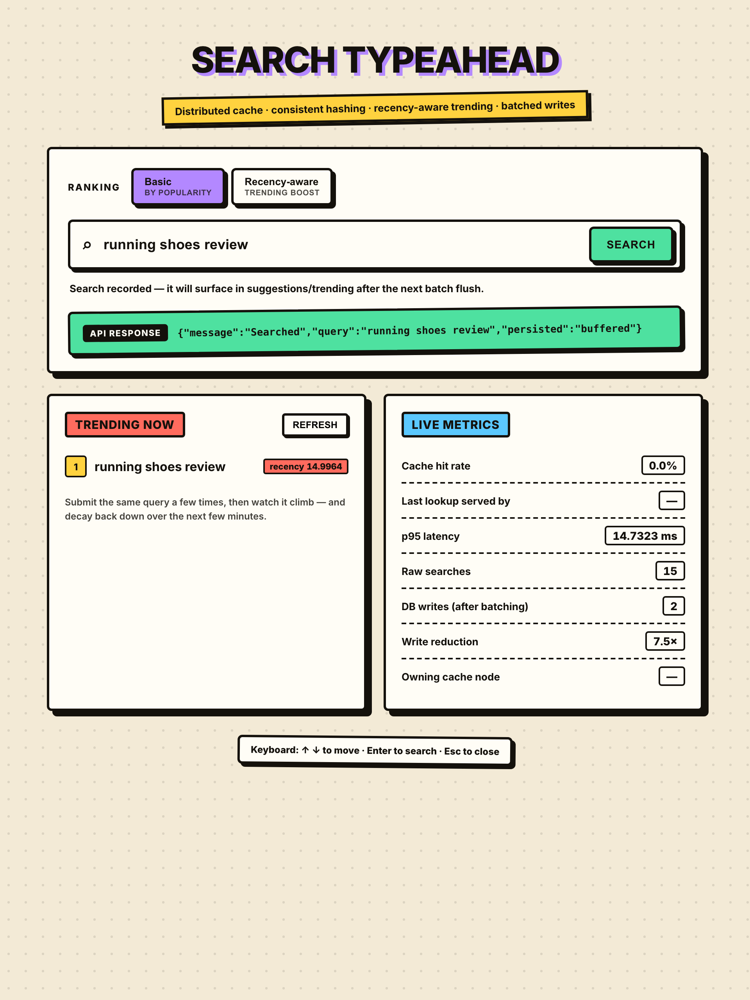
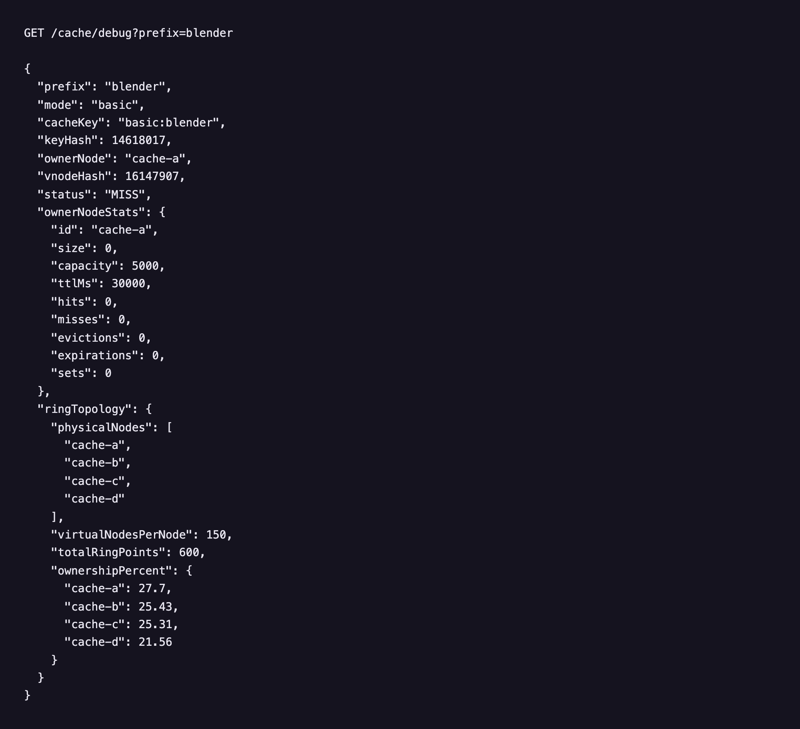
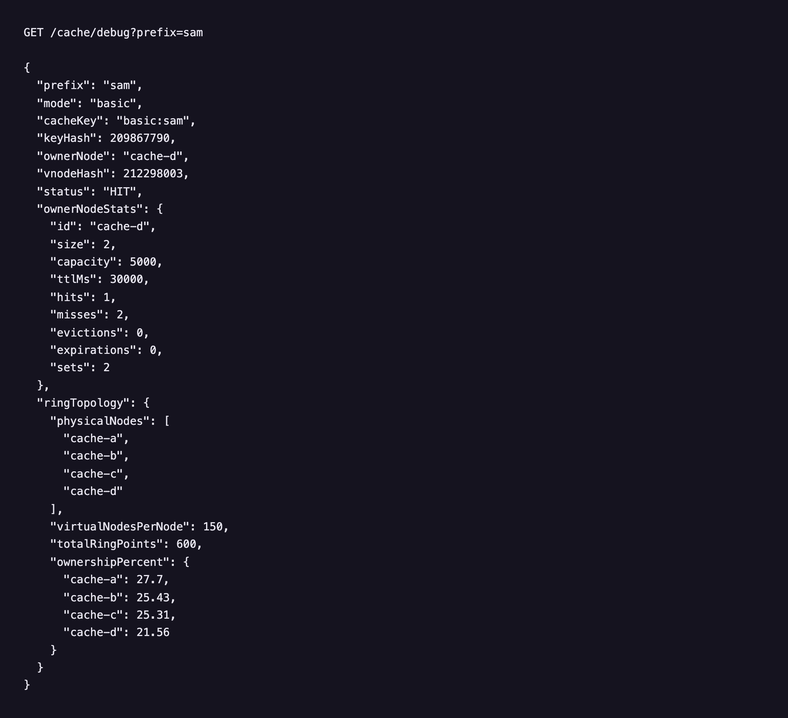
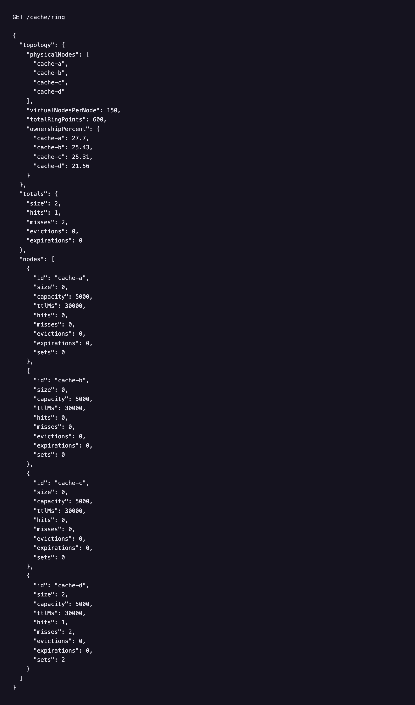
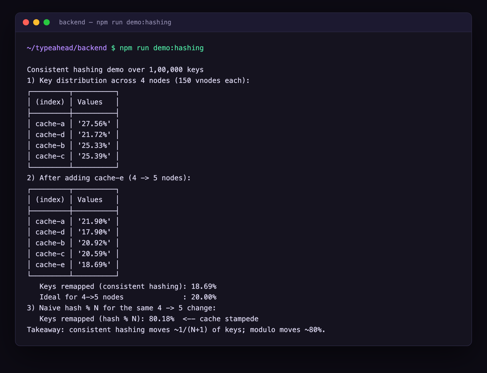

# Search Typeahead (HLD101)

A search-typeahead system: it suggests popular queries as you type, records
searches, and is engineered around the backend data-system concerns the
assignment targets — a **distributed cache sharded with consistent hashing**,
**recency-aware trending**, and **batched writes** with a write-ahead log for
crash durability.

Backend is **TypeScript + Express** (run directly with `tsx`); frontend is plain
HTML/CSS/JS. Primary store is SQLite via Node's built-in `node:sqlite` (no native
build step, no external DB server).

> Docs: [APIDOCS.md](APIDOCS.md) · [ARCHITECTURE.md](ARCHITECTURE.md) ·
> [DESIGNCHOICES.md](DESIGNCHOICES.md) · [PERFORMANCEREPORT.md](PERFORMANCEREPORT.md)

---

## Screenshots

| Landing page | Typeahead suggestions (`sam`) |
|---|---|
|  |  |
| **Search submitted — response + trending + live metrics** | **Recency-aware ranking** |
|  |  |
| **`GET /cache/debug` — cache miss** | **`GET /cache/debug` — cache hit** |
|  |  |
| **`GET /cache/ring` — keyspace distribution** | **`npm run demo:hashing` — consistent-hashing proof** |
|  |  |

In shot 4, recency mode promotes `running shoes review` (score 121, only 15 recent
searches) **above** `running shoes` (score 4.9, 80,250 all-time) — the recency
boost in action. Shots 5–6 show the same prefix routed to its owning cache node,
flipping from `MISS` to `HIT` once warmed.

---

## 1. Quick start

```bash
cd backend
npm install
npm run generate        # writes backend/data/queries.json (120k Zipf-distributed queries)
npm start               # seeds the store on first run, serves http://localhost:3000
```

Open <http://localhost:3000> and start typing. The frontend is served by the
backend, so there's nothing else to run.

Other commands (from `backend/`):

```bash
npm run benchmark        # latency, cache hit rate, write reduction, hash churn (server must be up)
npm run demo:hashing     # standalone consistent-hashing proof (no server needed)
npm run typecheck        # tsc --noEmit (strict)
npm run dev              # tsx watch (auto-reload)
```

Requirements: **Node.js ≥ 22.5** (built-in `node:sqlite`). Developed on Node 25.

---

## 2. Project structure

```
README.md  APIDOCS.md  ARCHITECTURE.md  DESIGNCHOICES.md  PERFORMANCEREPORT.md
backend/
  data/queries.json              generated dataset (query + count); seeds the store
  package.json  tsconfig.json
  scripts/
    generateDataset.ts           synthesise 120k Zipf-distributed queries
    benchmark.ts                 performance harness
    demoConsistentHashing.ts     standalone hashing proof
  src/
    index.ts                     entry: build components, recover WAL, mount routes, listen
    config.ts  util.ts  types.ts shared config / helpers / domain types
    cache/
      ConsistentHashRing.ts      hash ring with virtual nodes
      DistributedCache.ts        LRU+TTL nodes routed by the ring
    data/
      Trie.ts                    in-memory prefix index (traverse-on-demand)
      db.ts                      SQLite primary store (node:sqlite)
    middleware/
      metricsMiddleware.ts       metrics store + request-timing middleware
    routes/
      suggest.ts search.ts trending.ts cacheDebug.ts metrics.ts
    services/
      SuggestionService.ts       cache-then-index read path
      TrendingService.ts         global recency leaderboard
      BatchWriter.ts             aggregating buffer + WAL + flusher
      Ranker.ts                  basic + recency-aware scoring
frontend/
  index.html  app.js  style.css  (debounce, keyboard nav, trending, live metrics)
screenshots/
```

---

## 3. Rubric coverage

| Component | Where | Summary |
| --- | --- | --- |
| **Basic (60)** | `data/`, `cache/`, `services/SuggestionService`, `frontend/` | Trie index + SQLite store + distributed cache (consistent hashing) + UI |
| **Trending (20)** | `services/TrendingService`, `services/Ranker` | Time-decayed recency blended with popularity |
| **Batch writes (20)** | `services/BatchWriter` | Aggregating buffer + WAL + periodic/size flush |

---

## 4. The read & write paths in one breath

- **Read (`GET /suggest`)** consults the distributed cache first; on a miss it
  ranks completions from the in-memory **Trie** (a hot projection of the primary
  store) and populates the cache. No disk hit per request.
- **Write (`POST /search`)** never touches the DB synchronously: searches are
  appended to a WAL, buffered, **aggregated** (repeats collapse into one row
  update), and flushed in batches.

---

## 5. Dataset

- **120,000 distinct queries**, counts following a **Zipf distribution**.
- Generated by `backend/scripts/generateDataset.ts` into
  `backend/data/queries.json`; the server seeds SQLite from it on first start.
- **Use a real dataset instead:** write any array of `{ "query": "...", "count": N }`
  to `backend/data/queries.json` (Wikipedia titles, an AOL query log, product
  names — aggregate to counts if needed) and delete `backend/data/typeahead.db` so
  it re-seeds. Everything downstream is source-agnostic.

See [APIDOCS.md](APIDOCS.md) for the endpoints, [ARCHITECTURE.md](ARCHITECTURE.md)
for how the layers fit together, [DESIGNCHOICES.md](DESIGNCHOICES.md) for the
trade-offs (and a real bug we fixed), and [PERFORMANCEREPORT.md](PERFORMANCEREPORT.md)
for measured numbers.
